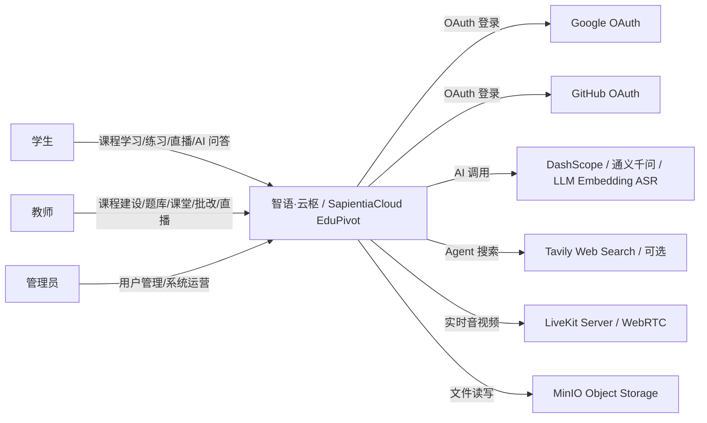
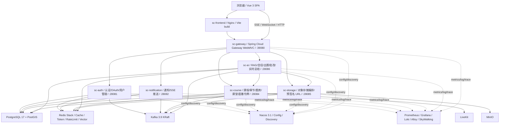
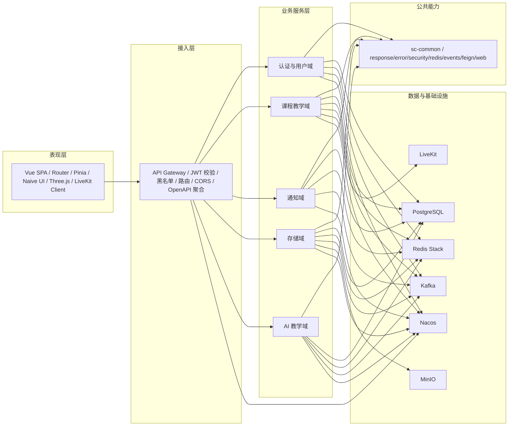
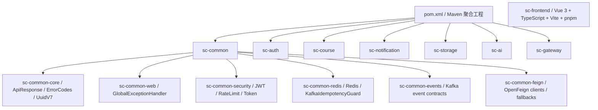
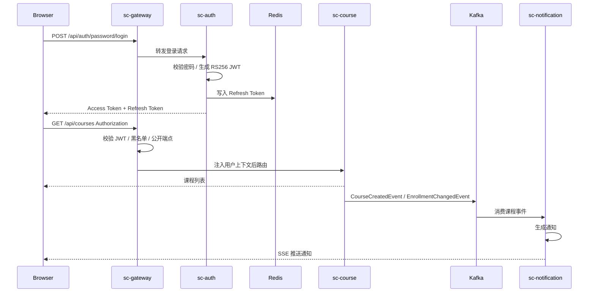
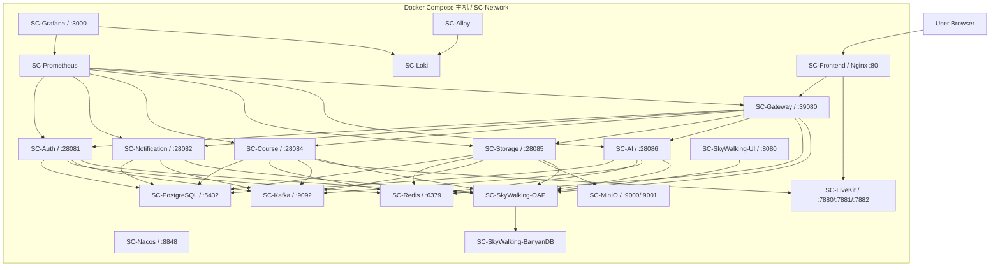
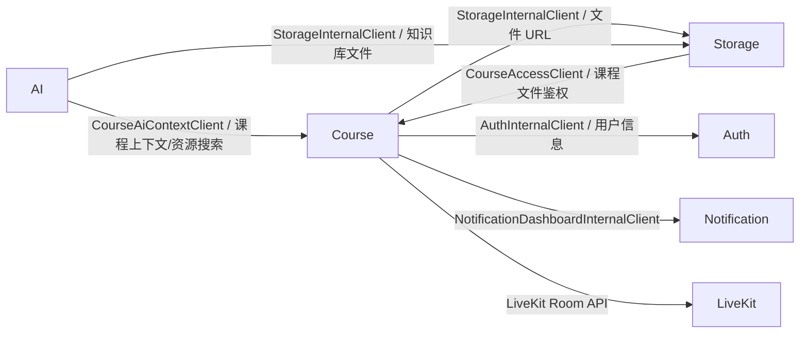
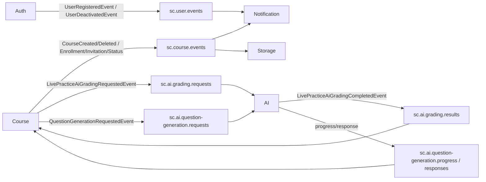
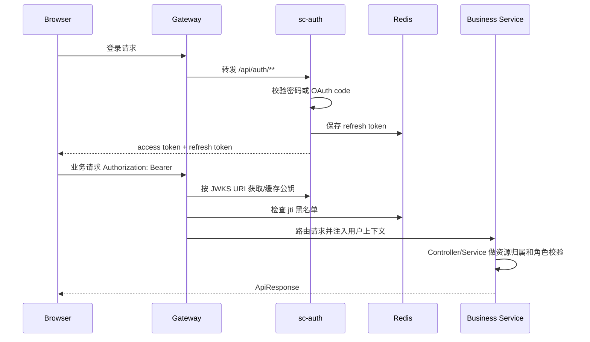

# 智语·云枢架构说明书

版本：2.0.0-SNAPSHOT  
日期：2026-06-27  
适用范围：SapientiaCloud EduPivot Redesign 当前代码库

## 1. 文档说明

### 1.1 目的

本文档描述智语·云枢（SapientiaCloud EduPivot）的系统架构，用于架构评审、研发协作、部署运维和后续演进决策。文档内容来自当前仓库代码、`CLAUDE.md`、`docs/DESIGN.md`、Nacos 配置、Docker Compose 编排和数据库迁移脚本。

### 1.2 格式来源

经联网检索，本文档采用以下资料组合形成项目化格式：

- ISO/IEC/IEEE 42010 的“利益相关方、关注点、视图、视点”思想：<https://www.iso-architecture.org/42010/cm/>
- C4 Model 的上下文、容器、组件、动态、部署图层次：<https://c4model.com/>
- Kruchten 4+1 视图模型的逻辑、开发、进程、物理、场景视图组织方式：<https://www.cs.ubc.ca/~gregor/teaching/papers/4+1view-architecture.pdf>
- IEEE 1016 软件设计描述中“设计视图 + 设计依据”的组织方式：<https://cengproject.cankaya.edu.tr/wp-content/uploads/sites/10/2017/12/SDD-ieee-1016-2009.pdf>

本文档偏架构层面，详细模块设计见 [DESIGN-SPEC.md](./DESIGN-SPEC.md)。

### 1.3 读者

| 读者 | 关注点 |
|---|---|
| 项目负责人 | 系统范围、能力边界、架构风险、演进方向 |
| 后端工程师 | 微服务边界、通信方式、公共模块、数据归属 |
| 前端工程师 | 前端容器、网关路由、认证链路、实时通信入口 |
| 测试工程师 | 关键业务链路、集成边界、可观测性入口 |
| 运维/部署人员 | 容器拓扑、依赖关系、健康检查、配置中心、监控日志 |

### 1.4 架构目标

- 以微服务拆分承载认证、课程、通知、存储、AI 等独立业务域。
- 以前端 SPA + API Gateway 统一用户入口和认证边界。
- 通过 Nacos 管理配置和服务发现，通过 Docker Compose 提供本地/单机部署拓扑。
- 通过 PostgreSQL、Redis Stack、Kafka、MinIO、LiveKit 支撑持久化、缓存、异步事件、对象存储和实时音视频。
- 通过 Prometheus、Grafana、Loki、Alloy、SkyWalking 建立指标、日志和链路追踪能力。

## 2. 系统概览

### 2.1 产品定位

智语·云枢是面向高等教育场景的云原生智慧教学平台，核心能力包括课程管理、章节内容、题库与练习、3D 虚拟教室、直播课堂、通知推送、文件存储和 AI 教学助手。

### 2.2 用户与外部系统上下文



### 2.3 容器视图



## 3. 架构视图

### 3.1 逻辑视图



### 3.2 开发视图

后端为 Maven 聚合工程，根工程 `com.dayz:sc-edupivot:2.0.0-SNAPSHOT` 聚合公共模块和业务服务。



典型业务服务包结构：

```text
com.dayz.sc.{service}
  controller        REST / SSE 入口
  service           业务编排与事务边界
  repository        仓储接口
  repository.impl   MyBatis-Plus 仓储实现
  mapper            BaseMapper 接口
  model.entity      数据库实体
  model.dto         请求 DTO
  model.vo          响应 VO
  model.enums       枚举
  config            服务配置
  event/kafka       Kafka 发布与消费
  client            外部或内部服务客户端
```

前端采用功能模块组织：

```text
sc-frontend/src
  app              入口、路由、i18n
  layouts          应用布局
  features         auth / dashboard / course / classroom / ai / notification 等
  shared           axios 请求、通用组件、类型、样式、组合式函数
  vendor           第三方/本地化资源
```

### 3.3 进程与运行视图



运行时交互方式：

| 类型 | 使用场景 | 技术 |
|---|---|---|
| 同步 HTTP | 浏览器访问业务接口、服务间查询 | REST + OpenFeign |
| 流式 HTTP | AI 聊天、通知、弹幕、随堂练习事件 | SSE |
| WebSocket | 3D 教室座位同步、AI 课堂音频总结 | Spring WebSocket |
| 异步事件 | 用户/课程事件、AI 批改、AI 出题进度 | Kafka |
| 预签名 URL | 文件上传、下载、预览 | MinIO Presigned URL |
| WebRTC | 直播课堂音视频 | LiveKit |

### 3.4 物理部署视图



关键部署特征：

- 所有容器加入 `SC-Network` bridge 网络。
- 服务通过 `healthcheck` 和 `depends_on.condition` 控制启动顺序。
- `nacos-config-init` 在 Nacos 健康后导入配置。
- Java 服务通过 SkyWalking Java Agent 发送链路数据。
- Prometheus 抓取 `/actuator/prometheus`，Alloy 从 Docker 日志采集到 Loki。

## 4. 服务职责与边界

| 服务 | 职责 | 数据归属 | 主要对外路径 |
|---|---|---|---|
| sc-gateway | 统一入口、JWT 验证、Token 黑名单、路由、OpenAPI 代理、内部端点屏蔽 | 无业务表 | `/api/**`, `/openapi/**` |
| sc-auth | 登录注册、OAuth、用户资料、学生/教师资料、JWT/JWKS、Refresh Token | `auth_*`，历史遗留含 `edu_student`/`edu_teacher` | `/api/auth/**` |
| sc-course | 课程、章节、选课、助教邀请、论坛、题库、练习、课堂、直播令牌、Dashboard | `edu_*` | `/api/courses/**`, `/api/chapters/**`, `/api/class-sessions/**` 等 |
| sc-notification | 通知创建、阅读状态、目标用户、SSE 推送、事件消费 | `ntf_*` | `/api/notifications/**` |
| sc-storage | 上传会话、对象元数据、MinIO 预签名 URL、课程文件鉴权、文档转换、清理任务 | `storage_*` | `/api/storage/**` |
| sc-ai | AI 会话、RAG 知识库、Agent 搜索、题目生成、AI 批改、课堂实时总结 | `ai_*`，Redis 向量索引 | `/api/ai/**` |
| sc-frontend | SPA、路由守卫、Token 持久化、页面与交互 | 浏览器 localStorage | 前端路由 |

## 5. 数据架构

### 5.1 数据库归属

所有服务共享同一个 PostgreSQL 实例，但通过表前缀和独立 Flyway history 表隔离服务归属。

| 服务 | 表前缀 | Flyway history 表 | 主要表 |
|---|---|---|---|
| sc-auth | `auth_` | `flyway_schema_history_auth` | `auth_users`, `auth_user_identities` |
| sc-course | `edu_` | `flyway_schema_history_course` | `edu_course`, `edu_chapter`, `edu_enrollment`, `edu_question_*`, `edu_class_*` |
| sc-notification | `ntf_` | `flyway_schema_history_notification` | `ntf_notification`, `ntf_notification_target`, `ntf_read_status` |
| sc-storage | `storage_` | `flyway_schema_history_storage` | `storage_object`, `storage_upload_session` |
| sc-ai | `ai_` | `flyway_schema_history_ai` | `ai_conversation`, `ai_message`, `ai_knowledge_doc`, `ai_live_*` |

说明：早期 `sc-auth` 迁移曾创建 `edu_student`、`edu_teacher` 和部分 `ntf_*` 表，这是历史例外；新增迁移禁止跨服务表前缀。

### 5.2 数据模型概览

```mermaid
erDiagram
    AUTH_USERS ||--o{ AUTH_USER_IDENTITIES : binds
    AUTH_USERS ||--o| EDU_STUDENT : profile
    AUTH_USERS ||--o| EDU_TEACHER : profile

    EDU_COURSE ||--o{ EDU_CHAPTER : contains
    EDU_COURSE ||--o{ EDU_ENROLLMENT : enrolls
    EDU_COURSE ||--o{ EDU_COURSE_TEACHER : assistants
    EDU_COURSE ||--o{ EDU_COURSE_FILE : binds
    EDU_COURSE ||--o{ EDU_FORUM_POST : discusses
    EDU_COURSE ||--o{ EDU_QUESTION_BANK : owns
    EDU_COURSE ||--o{ EDU_CLASS_SESSION : schedules

    EDU_QUESTION_BANK ||--o{ EDU_QUESTION : contains
    EDU_QUESTION ||--o{ EDU_QUESTION_OPTION : options
    EDU_QUESTION ||--o{ EDU_QUESTION_ANSWER : answers

    EDU_CLASS_SESSION ||--o{ EDU_CLASS_PARTICIPANT : seats
    EDU_CLASS_SESSION ||--o{ EDU_CLASS_BARRAGE : barrages
    EDU_CLASS_SESSION ||--o{ EDU_LIVE_PRACTICE_GROUP : publishes
    EDU_LIVE_PRACTICE_GROUP ||--o{ EDU_LIVE_PRACTICE_QUESTION : snapshots
    EDU_LIVE_PRACTICE_QUESTION ||--o{ EDU_LIVE_PRACTICE_SUBMISSION : submissions

    NTF_NOTIFICATION ||--o{ NTF_NOTIFICATION_TARGET : targets
    NTF_NOTIFICATION ||--o{ NTF_READ_STATUS : reads

    STORAGE_OBJECT ||--o{ STORAGE_UPLOAD_SESSION : uploads
    EDU_COURSE_FILE }o--|| STORAGE_OBJECT : fileId

    AI_CONVERSATION ||--o{ AI_MESSAGE : messages
    AI_KNOWLEDGE_DOC }o--|| STORAGE_OBJECT : sourceFile
    AI_LIVE_SUMMARY_SESSION ||--o{ AI_LIVE_TRANSCRIPT_SEGMENT : transcript
    AI_LIVE_SUMMARY_SESSION ||--o{ AI_LIVE_SUMMARY_SNAPSHOT : summary
```



### 5.3 Redis 用途

| 用途 | 示例 |
|---|---|
| 缓存 | 用户、课程详情、课程教师 ID 列表等 Cache-Aside 数据 |
| 会话安全 | Refresh Token、Access Token 黑名单 |
| 限流 | `@RateLimited` Redis 滑动窗口 |
| Kafka 幂等 | `kafka:idempotent:{groupId}:{eventId}` |
| WebSocket 令牌 | 课堂座位同步一次性短令牌 |
| 向量检索 | Spring AI Redis Vector Store / RediSearch |
| LiveKit 支撑 | LiveKit 服务使用 Redis 协调 |

## 6. 通信架构

### 6.1 网关路由

网关路由由 Nacos `sc-edupivot-gateway-routes-{profile}.yaml` 提供。

| 路由 | 目标服务 |
|---|---|
| `/api/auth/**` | sc-auth |
| `/api/notifications/**` | sc-notification |
| `/api/courses/**`, `/api/chapters/**`, `/api/class-sessions/**`, `/api/live-practices/**`, `/api/question-banks/**` 等 | sc-course |
| `/api/storage/**` | sc-storage |
| `/api/ai/**` | sc-ai |
| `/openapi/{service}` | 各服务 `/v3/api-docs` |

`/api/storage/internal/**` 与 `/api/notifications/internal/**` 在网关层返回 403，内部调用应走服务发现和 Feign。

### 6.2 同步服务调用



同步调用采用 OpenFeign，并通过 `sc-common-feign` 提供 Authorization 中继、Resilience4j 熔断和 fallback。

### 6.3 异步事件



事件处理要点：

- Topic 常量集中在 `KafkaTopicConstants`。
- 消费端使用手动 ack。
- 失败进入 `.DLT` 死信 Topic。
- Redis `KafkaIdempotencyGuard` 以 `eventId` 做 24 小时幂等保护。
- 课程事件在事务提交后发送，减少脏事件。

## 7. 安全架构

### 7.1 认证与授权链路



### 7.2 安全策略

| 关注点 | 策略 |
|---|---|
| Token 签名 | sc-auth 用 RS256 私钥签发，其他服务通过 JWKS 验签 |
| Access Token | 约 30 分钟有效，包含 subject、role、jti |
| Refresh Token | Redis 存储，约 7 天有效，刷新时轮转 |
| 登出 | 将 access token jti 加入 Redis 黑名单直到自然过期 |
| 限流 | `@RateLimited` + Redis Lua 滑动窗口 |
| 密码 | BCrypt |
| 服务内部端点 | 网关屏蔽内部路径，服务间通过 Feign 访问 |
| 前端会话 | localStorage 持久化 token，401 自动刷新，刷新失败清理会话 |

## 8. 可观测性与运维

| 能力 | 实现 |
|---|---|
| 健康检查 | `/actuator/health/liveness` |
| 指标 | Micrometer Prometheus Registry + Prometheus |
| Dashboard | Grafana dashboards 和 provisioning |
| 日志 | Docker logs -> Alloy -> Loki -> Grafana |
| 链路追踪 | SkyWalking Java Agent -> OAP -> BanyanDB -> UI |
| API 文档 | SpringDoc OpenAPI + Scalar；网关代理 `/openapi/*` |
| 配置 | Nacos common + infra + gateway routes |

## 9. 质量属性

| 属性 | 架构支撑 | 风险/约束 |
|---|---|---|
| 可维护性 | 服务按业务域拆分，公共能力沉入 sc-common | 公共模块变更影响面大，需要保持向后兼容 |
| 可扩展性 | 网关路由 + Nacos 服务发现 + 独立容器 | 当前 Compose 是单机部署，水平扩展需外部负载和状态服务规划 |
| 安全性 | Gateway 验证 JWT，服务内资源归属校验，Redis 黑名单 | 内部接口仍需保持最小暴露，不能依赖“路径看起来内部” |
| 一致性 | 事务内写库，提交后发事件，消费者幂等 | 跨服务最终一致，需通过补偿/重试处理异步失败 |
| 性能 | Redis Cache-Aside、查询索引、虚拟线程、SSE/WebSocket 长连接 | AI、ASR、文档解析等外部调用耗时高，需要降级和限流 |
| 可观测性 | Prometheus/Grafana/Loki/SkyWalking | 需要在部署环境持续校验 agent、日志采集和指标抓取 |
| 可部署性 | Dockerfile + Compose + Nacos 初始化 | 生产环境如迁移到 K8s，需要重写部署编排和密钥管理 |

## 10. 关键架构决策

| 决策 | 选择 | 理由 |
|---|---|---|
| 后端形态 | Spring Cloud 微服务 | 匹配认证、课程、通知、存储、AI 的独立演进和部署边界 |
| 入口 | Vue SPA + Spring Cloud Gateway | 统一认证、路由、跨域和 OpenAPI 聚合 |
| 配置中心 | Nacos | 支持 common/infra/profile 分层配置和服务发现 |
| 数据库 | 共享 PostgreSQL 实例 + 表前缀隔离 | 降低部署复杂度，同时保持服务数据归属 |
| 迁移 | 各服务独立 Flyway history 表 | 避免多个服务抢占同一迁移历史 |
| 缓存/向量 | Redis Stack | 同时支持普通缓存、限流、幂等和 AI 向量检索 |
| 消息队列 | Kafka | 支撑通知、清理、AI 批改、出题等异步最终一致流程 |
| 对象存储 | MinIO + 预签名 URL | 避免文件流量穿透业务服务，便于权限和生命周期管理 |
| 实时音视频 | LiveKit | 用成熟 WebRTC 服务承载直播课堂 |
| AI 接入 | Spring AI + DashScope OpenAI 兼容端点 | 与 Spring Boot 技术栈统一，降低模型供应商耦合 |

## 11. 架构风险与演进建议

| 风险 | 说明 | 建议 |
|---|---|---|
| 共享数据库边界弱化 | 物理共享 schema 容易诱发跨服务查表 | 坚持表前缀归属；跨服务读写走 API/事件；脚本校验迁移归属 |
| 长连接规模 | SSE/WebSocket/LiveKit 并发增长后单实例压力上升 | 为 Gateway、Course、Notification、AI 制定横向扩展和连接亲和策略 |
| AI 外部依赖 | LLM/Embedding/ASR/API Search 受外部服务稳定性影响 | 继续保持限流、熔断、超时、失败状态持久化和可重试队列 |
| 事件最终一致 | 课程删除后的通知/文件清理依赖异步消费 | 监控 DLT；提供后台补偿任务或人工重放机制 |
| 文档与代码漂移 | 业务发展快，架构图容易过期 | 将本文档纳入 PR 检查项；涉及服务、Topic、表、部署变更时同步更新 |

