# 智语·云枢设计说明书

版本：2.0.0-SNAPSHOT  
日期：2026-06-27  
适用范围：SapientiaCloud EduPivot Redesign 当前代码库

## 1. 文档说明

### 1.1 目的

本文档说明智语·云枢的设计思路、模块划分、数据设计、接口设计、关键流程和实现约束。它面向开发、测试和后续维护，补充 [ARCHITECTURE.md](./ARCHITECTURE.md) 中偏系统级的架构描述。

### 1.2 格式来源

本文档按联网检索后的软件设计说明书常见结构整理，参考 IEEE 1016 的 SDD 视图思想、C4 Model 的图示层次、ISO/IEC/IEEE 42010 的关注点组织方式，并结合本项目代码实际裁剪为：

1. 系统概述
2. 设计目标与原则
3. 总体设计
4. 模块设计
5. 数据设计
6. 接口设计
7. 关键流程设计
8. 非功能设计
9. 设计决策与约束

### 1.3 设计范围

本文档覆盖：

- 前端 SPA、路由、状态和接口请求设计。
- 后端网关、认证、课程、通知、存储、AI 服务设计。
- 公共模块、数据库、缓存、消息、实时通信和部署相关设计。

本文档不覆盖：

- 第三方平台内部实现，例如 Google/GitHub OAuth、DashScope、LiveKit、MinIO 的内部架构。
- 每一个 Controller 方法的逐项参数字典。接口清单以模块和资源为粒度，具体字段以代码和 OpenAPI 为准。

## 2. 系统设计目标

### 2.1 业务目标

- 为学生提供课程学习、章节阅读、随堂练习、直播课堂、通知接收和 AI 辅导能力。
- 为教师提供课程建设、章节管理、助教邀请、题库建设、课堂管理、直播授课、AI 出题和 AI 批改能力。
- 为管理员提供用户管理、学生/教师管理和系统运营入口。

### 2.2 技术目标

- 前后端分离，前端通过统一网关访问业务接口。
- 后端按业务域拆分，服务内部保持 Controller-Service-Repository-Mapper 分层。
- 统一响应、错误码、鉴权、限流、缓存、事件、Feign、异常处理和空安全约束。
- 通过配置中心将环境差异从代码中剥离。
- 通过可观测性体系支持调试、压测、部署和生产问题定位。

### 2.3 设计原则

- 简单优先：只为当前真实业务边界设计，不引入无需求的通用化平台能力。
- 服务自治：服务维护自己的表前缀、迁移、业务规则和事务边界。
- 网关统一入口：前端公开流量只经 Gateway 进入业务服务。
- 数据最终一致：跨服务协作优先采用事件和幂等消费，不用跨服务数据库事务。
- 安全前置但不下沉消失：Gateway 负责第一道认证，业务服务仍负责资源归属和角色判断。
- 文档贴近代码：设计说明以当前实现为准，避免描述未落地能力为“已完成”。

## 3. 总体设计

### 3.1 分层设计

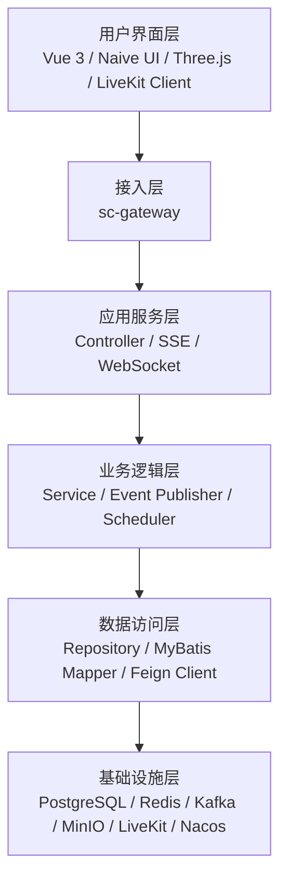

### 3.2 后端内部标准结构

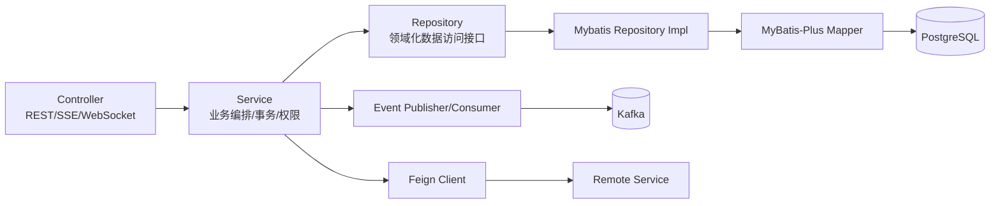

设计约束：

- Controller 统一返回 `ApiResponse<T>` 或 `ApiResponse<PageResponse<T>>`。
- DTO 使用 Java record，实体使用 MyBatis-Plus 注解映射。
- Service 层持有事务边界和业务规则，Repository 层封装 Mapper。
- UUID 统一使用 `UuidV7Generator.generate()`。
- 异常统一使用 `BusinessException + ErrorCodes`。
- 包级空安全使用 `@NullMarked`，可空字段显式标注。

### 3.3 前端内部标准结构

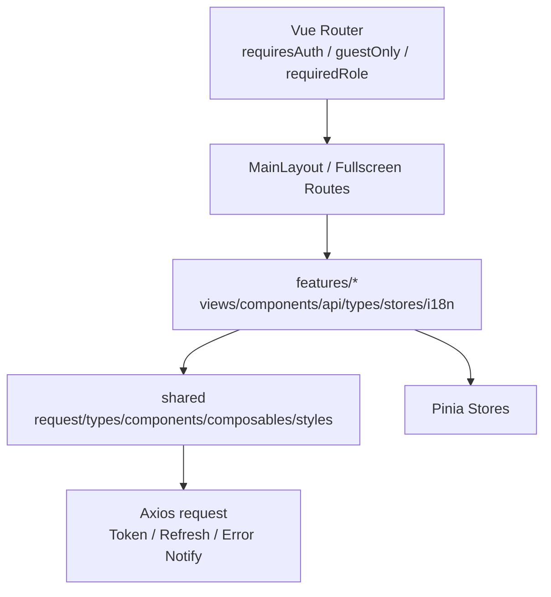

设计约束：

- 普通业务页走 `MainLayout`，3D 教室/直播类沉浸页面使用顶层受保护路由。
- API 请求统一走 `shared/api/request.ts`，从 `ApiResponse<T>` 解包 `data`。
- Access Token、Refresh Token 和用户信息存 localStorage。
- 401 自动刷新会话；刷新失败清理本地会话并弹出过期提示。
- 多语言使用 Vue I18n，按功能模块拆分翻译。

## 4. 模块设计

### 4.1 sc-gateway

职责：

- 作为浏览器访问后端的唯一 API 入口。
- 基于 Nacos 路由配置将 `/api/**` 分发到业务服务。
- 作为 OAuth2 Resource Server 校验 JWT。
- 检查 Redis 中的 Token 黑名单。
- 屏蔽公开流量访问内部接口。
- 聚合各服务 OpenAPI 文档。

核心设计：

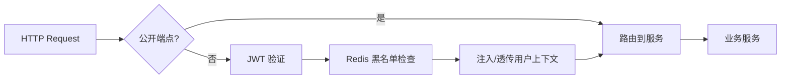

主要路由：

| Path | 服务 |
|---|---|
| `/api/auth/**` | sc-auth |
| `/api/notifications/**` | sc-notification |
| `/api/courses/**`, `/api/dashboard/**`, `/api/class-sessions/**`, `/api/live-practices/**` | sc-course |
| `/api/storage/**` | sc-storage |
| `/api/ai/**` | sc-ai |

### 4.2 sc-auth

职责：

- 邮箱密码注册与登录。
- Google/GitHub OAuth 登录。
- 首次登录 Onboarding，补齐角色和展示信息。
- 用户资料、学生资料、教师资料管理。
- 签发 Access Token、Refresh Token，提供 JWKS。
- 发布用户注册、停用等事件。

核心对象：

| 对象 | 说明 |
|---|---|
| User | 登录账号、邮箱、密码、角色、头像、状态、审计字段 |
| UserIdentity | OAuth provider 与用户绑定 |
| Student | 学生扩展资料 |
| Teacher | 教师扩展资料 |

认证流程：

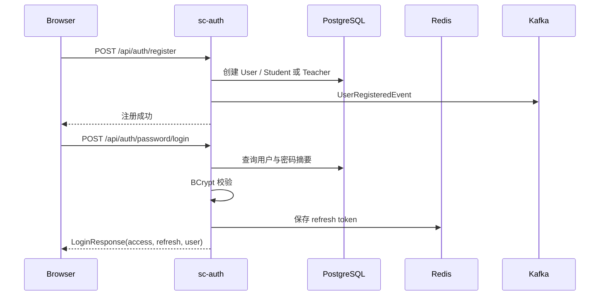

### 4.3 sc-course

职责：

- 课程创建、编辑、发布、归档、删除。
- 章节树、章节互动、点赞、浏览。
- 选课、退课、助教邀请。
- 课程论坛和回复。
- 题库、题目、选项、答案、练习会话。
- 课堂会话、座位同步、弹幕、直播状态、LiveKit token。
- 随堂练习发布、提交、AI 批改结果落库。
- Dashboard 聚合。

核心领域模型：

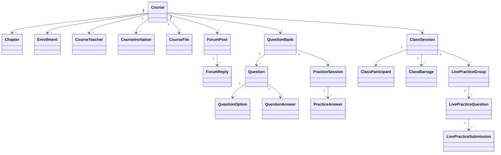

设计要点：

- 课程详情等读多写少数据通过 Redis/Spring Cache 缓存。
- 课程创建、删除、状态变更、选课和邀请变更发布 Kafka 事件。
- 课堂座位同步使用 Redis 一次性短令牌建立 WebSocket 连接。
- 直播令牌由 sc-course 基于 LiveKit API Key/Secret 签发。
- 直播开始、暂停、恢复、停止状态通过 WebSocket 广播。
- AI 批改通过 Kafka 请求 sc-ai，结果由 sc-course 消费后更新提交记录并通过 SSE 通知学生。

### 4.4 sc-notification

职责：

- 通知创建、查询、阅读、删除、撤回。
- 面向用户或全体的通知目标管理。
- 消费用户事件和课程事件生成通知。
- SSE 长连接推送通知。
- Dashboard 通知摘要。

通知推送设计：

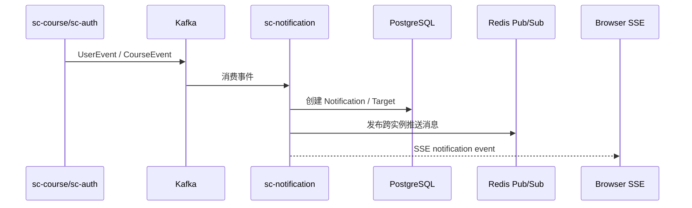

设计要点：

- `NotificationSseEmitter` 管理本实例用户连接。
- Redis SSE Publisher/Subscriber 支持多实例广播。
- Kafka 消费使用 `KafkaIdempotencyGuard` 防重复通知。

### 4.5 sc-storage

职责：

- 创建上传会话。
- 完成上传后保存对象元数据。
- 生成文件下载和访问预签名 URL。
- 删除文件并软删除对象记录。
- 按课程访问权限鉴权。
- 文档转换和过期上传清理。
- 消费课程删除事件清理课程文件。

核心对象：

| 对象 | 说明 |
|---|---|
| StorageObject | 文件元数据、bucket、objectKey、owner、scope、usage、status |
| StorageUploadSession | 上传会话、过期时间、完成状态 |

文件上传/绑定流程：

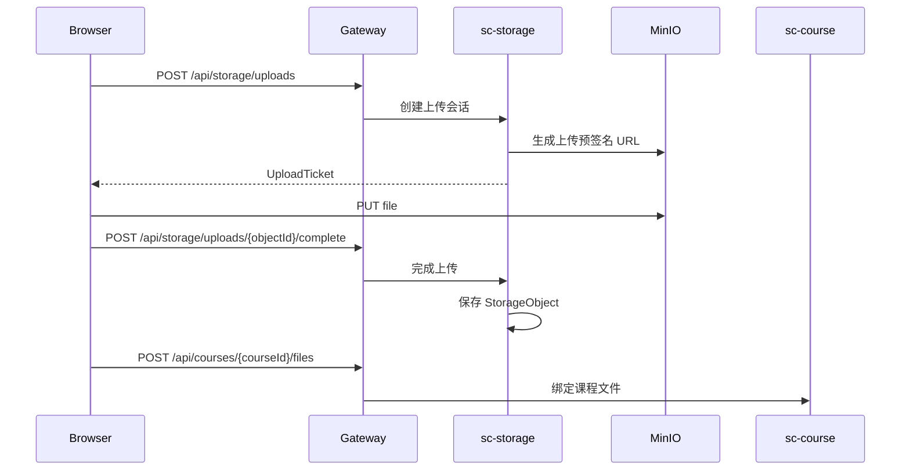

### 4.6 sc-ai

职责：

- AI 会话和消息管理。
- RAG 知识库文档索引。
- 聊天 SSE 流式输出。
- 课程上下文 Agent 搜索。
- AI 自动出题和生成进度桥接。
- 随堂练习 AI 批改。
- 课堂实时语音总结：音频 WebSocket、ASR、转写片段、摘要快照、SSE 推送。

核心对象：

| 对象 | 说明 |
|---|---|
| Conversation | AI 会话，属于用户 |
| ChatMessage | 会话消息，含 role、content、trace 等 |
| KnowledgeDoc | 知识库文档元数据，向量存 Redis |
| LiveSummarySession | 课堂实时总结会话 |
| LiveTranscriptSegment | ASR 最终转写片段 |
| LiveSummarySnapshot | 增量摘要快照 |

RAG 问答流程：

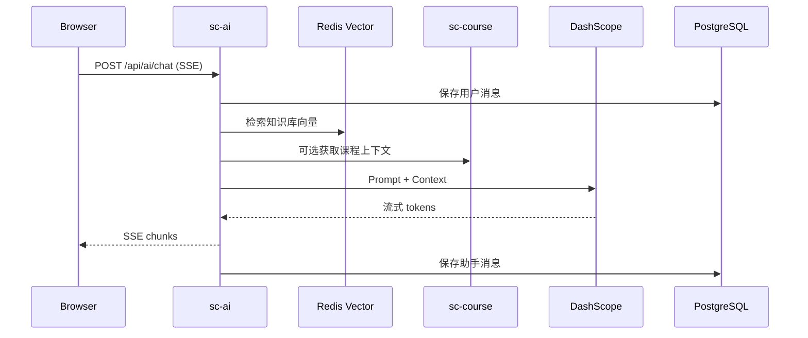

AI 批改流程：

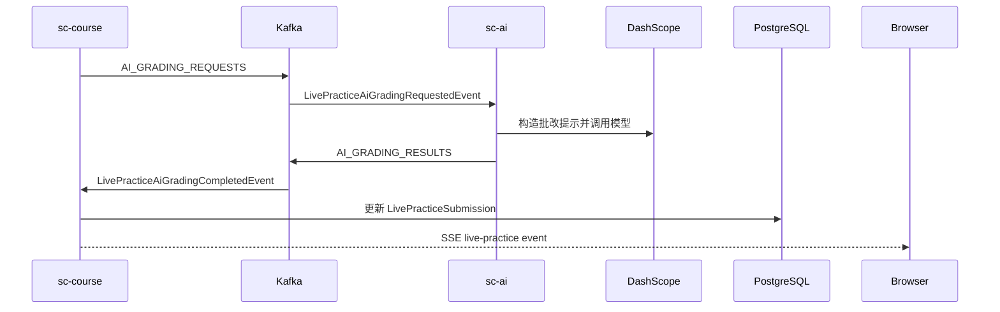

课堂实时总结流程：

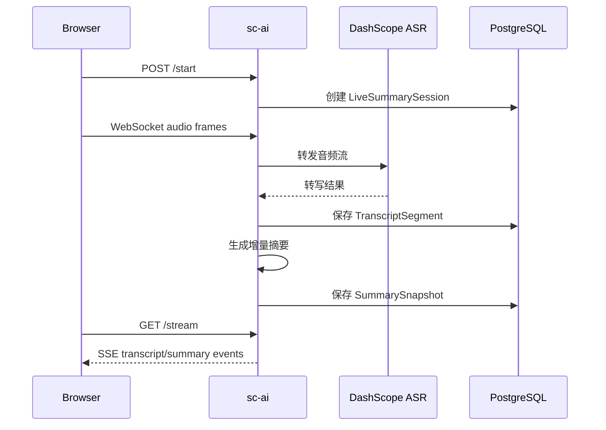

## 5. 数据设计

### 5.1 数据库规范

- 主键使用 UUID，业务代码通过 UUID v7 生成。
- 表按服务前缀归属：`auth_`、`edu_`、`ntf_`、`storage_`、`ai_`。
- 每个服务拥有独立 Flyway history 表。
- 时间字段优先使用 `TIMESTAMPTZ`。
- 软删除字段为 `deleted SMALLINT`，必要时补充 `deleted_at`。
- 新迁移只能新增前向迁移，不能修改已应用迁移。

### 5.2 主要数据表

| 领域 | 表 |
|---|---|
| 认证用户 | `auth_users`, `auth_user_identities`, `edu_student`, `edu_teacher` |
| 课程 | `edu_course`, `edu_course_teacher`, `edu_enrollment`, `edu_course_invitation` |
| 内容 | `edu_chapter`, `edu_chapter_like`, `edu_course_file` |
| 论坛 | `edu_forum`, `edu_forum_post`, `edu_forum_reply` |
| 题库练习 | `edu_question_bank`, `edu_question`, `edu_question_option`, `edu_question_answer`, `edu_practice_session`, `edu_practice_answer` |
| 课堂直播 | `edu_class_session`, `edu_class_participant`, `edu_class_barrage` |
| 随堂练习 | `edu_live_practice_group`, `edu_live_practice_question`, `edu_live_practice_submission` |
| 通知 | `ntf_notification`, `ntf_notification_target`, `ntf_read_status` |
| 存储 | `storage_object`, `storage_upload_session` |
| AI | `ai_conversation`, `ai_message`, `ai_knowledge_doc`, `ai_live_summary_session`, `ai_live_transcript_segment`, `ai_live_summary_snapshot` |

### 5.3 缓存设计

| 数据 | Key 示例 | 策略 |
|---|---|---|
| 用户基础信息 | `auth:user:{userId}` | Cache-Aside，读穿透保护 |
| OAuth 身份 | `auth:identity:{provider}:{providerUserId}` | Cache-Aside |
| Refresh Token | `auth:refresh:{token}` | 直接存储，7 天 TTL |
| Token 黑名单 | `auth:blacklist:{jti}` | 直接存储，剩余 TTL |
| 课程详情 | Spring Cache `courseDetail` | 写时删除，下次读重建 |
| Kafka 幂等 | `kafka:idempotent:{groupId}:{eventId}` | SETNX，24 小时 TTL |
| AI 向量 | `edupivot:ai:vec:*` | Redis Vector Store |

## 6. 接口设计

### 6.1 统一响应

```java
public record ApiResponse<T>(
        int code,
        String message,
        T data,
        Instant timestamp
)
```

分页响应：

```java
public record PageResponse<T>(
        List<T> records,
        long total,
        long page,
        long size
)
```

错误码范围：

| 范围 | 含义 |
|---|---|
| `0` | 成功 |
| `400xx` | 请求错误/参数校验 |
| `401xx` | 未授权/认证失败 |
| `403xx` | 禁止访问/资料未完善 |
| `404xx` | 资源不存在 |
| `500xx` | 系统错误 |

### 6.2 HTTP API 分组

| 分组 | 代表路径 | 说明 |
|---|---|---|
| Auth | `/api/auth/register`, `/api/auth/password/login`, `/api/auth/refresh`, `/api/auth/users/me` | 注册、登录、刷新、用户资料 |
| User Admin | `/api/auth/users`, `/api/auth/users/{id}` | 用户管理 |
| Course | `/api/courses`, `/api/courses/{id}` | 课程 CRUD |
| Chapter | `/api/chapters`, `/api/chapters/course/{courseId}` | 章节管理和章节树 |
| Enrollment | `/api/enrollments`, `/api/enrollments/my` | 选课管理 |
| Invitation | `/api/invitations/received`, `/api/invitations/sent` | 助教邀请 |
| Forum | `/api/forums/course/{courseId}/comments` | 课程讨论 |
| Question Bank | `/api/question-banks`, `/api/question-banks/questions` | 题库和题目 |
| Practice | `/api/practice-sessions` | 练习会话和答题 |
| Class Session | `/api/class-sessions` | 课堂、座位、直播、弹幕 |
| Live Practice | `/api/live-practices/**` | 随堂练习 |
| Notification | `/api/notifications`, `/api/notifications/subscribe` | 通知和 SSE |
| Storage | `/api/storage/uploads`, `/api/storage/files/{fileId}` | 上传、下载、转换、删除 |
| AI | `/api/ai/chat`, `/api/ai/conversations`, `/api/ai/knowledge-docs`, `/api/ai/live-summaries/**` | AI 聊天、会话、知识库、课堂总结 |

### 6.3 实时接口

| 类型 | 路径 | 说明 |
|---|---|---|
| SSE | `/api/notifications/subscribe` | 用户通知 |
| SSE | `/api/class-sessions/{id}/barrages/stream` | 课堂弹幕 |
| SSE | `/api/live-practices/subscribe` | 随堂练习事件 |
| SSE | `/api/ai/chat` | AI 聊天流式输出 |
| SSE | `/api/ai/live-summaries/class-sessions/{sessionId}/stream` | 实时课堂总结 |
| WebSocket | `/api/class-sessions/seats/ws` | 座位同步 |
| WebSocket | `/api/ai/live-summaries/class-sessions/{sessionId}/audio` | 课堂音频上传 |

### 6.4 内部接口

| 内部接口 | 调用方 | 说明 |
|---|---|---|
| `sc-auth /api/auth/users/internal/basic` | course/notification/ai | 批量用户基础信息 |
| `sc-auth /api/auth/users/internal/profile` | course/ai | 用户档案 |
| `sc-course /internal/courses/{courseId}/access` | storage | 课程文件访问判断 |
| `sc-course /internal/ai/context`, `/internal/ai/search`, `/internal/ai/resources` | ai | AI 课程上下文和资源搜索 |
| `sc-storage /api/storage/internal/files/**` | course/ai | 文件元数据和预签名 URL |
| `sc-notification /api/notifications/internal/dashboard/summary` | course/dashboard | 通知摘要 |

## 7. 关键流程设计

### 7.1 课程发布与通知

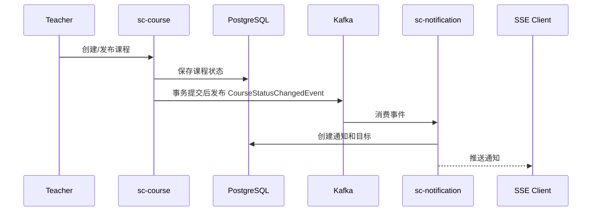

设计依据：

- 课程写库和事件发送解耦，事件在事务提交后发送。
- 通知侧消费事件并幂等处理，允许最终一致。

### 7.2 课堂座位同步

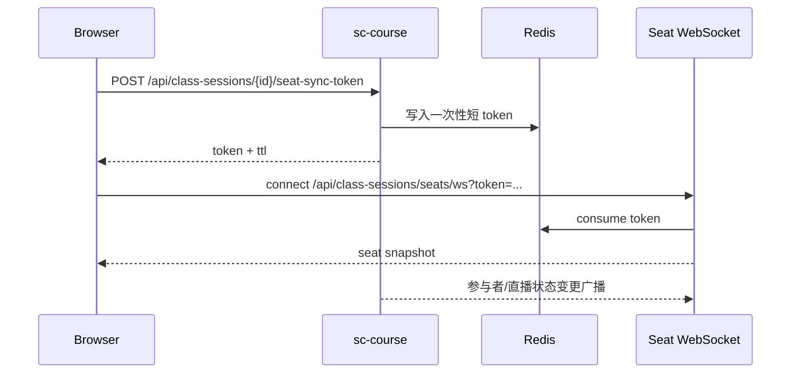

设计依据：

- WebSocket 握手不直接依赖 Authorization header，先通过受保护 HTTP 接口换取短令牌。
- Token 消费后失效，降低泄漏风险。

### 7.3 随堂练习与 AI 批改

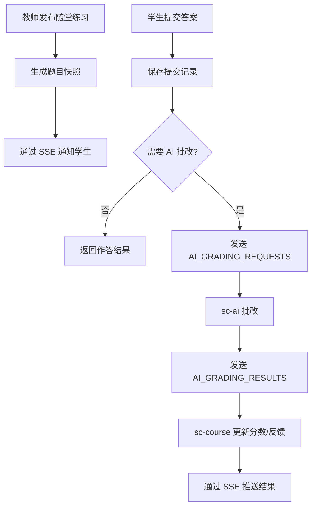

设计依据：

- 题目发布使用快照，避免题库后续编辑影响已发布练习。
- AI 批改异步化，避免学生提交接口被模型调用阻塞。
- 批改结果使用 Kafka 幂等消费，避免重复覆盖。

### 7.4 知识库入库与 RAG

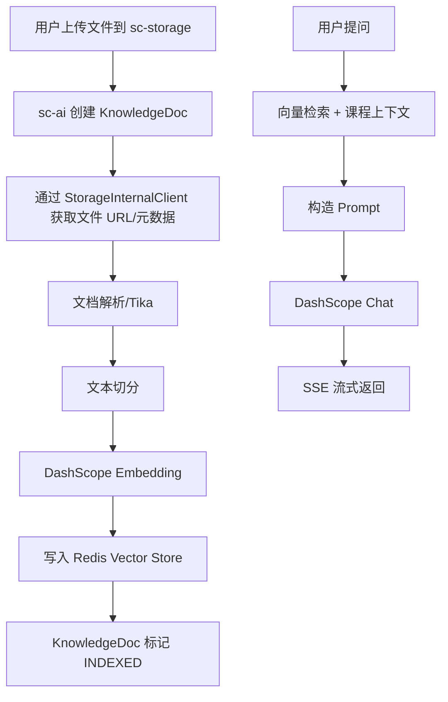

设计依据：

- 文件原始内容由 storage 管理，AI 只保存知识库元数据和向量索引。
- 向量和会话分离，便于后续重建索引。

### 7.5 文件删除与课程清理

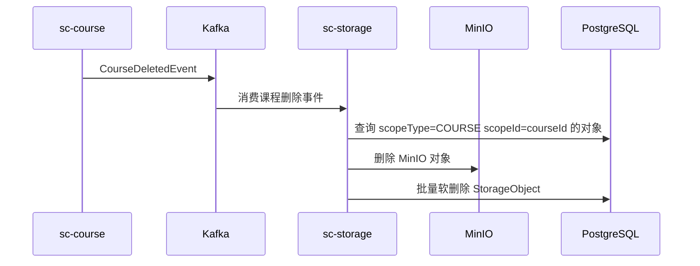

设计依据：

- 课程服务不直接操作 MinIO，避免跨域职责。
- 存储服务消费课程删除事件后做清理，保持服务边界。

## 8. 非功能设计

### 8.1 安全设计

- 所有业务接口默认需要认证，公开端点由 Nacos `edupivot.security.public-endpoints` 配置。
- Controller 从 `Jwt` 中提取用户 ID 和角色。
- 管理员、教师、学生的角色码约定：`0=管理员`，`1=学生`，`2=教师`。
- 资源访问必须做归属校验，例如课程教师/助教/选课学生、文件 owner/scope、AI 会话 userId。
- 高成本或敏感接口使用 `@RateLimited`。

### 8.2 事务设计

- 单服务内使用本地数据库事务。
- 跨服务一致性使用 Kafka 事件和幂等消费。
- 外部副作用不作为数据库事务的一部分，例如 LiveKit 房间删除、MinIO 对象清理需容忍最终一致。

### 8.3 容错设计

- Feign 调用配置 fallback，调用方需识别 `SERVICE_UNAVAILABLE`。
- Kafka 消费失败可重试并进入 DLT。
- Redis 缓存不可作为唯一数据源，业务数据以 PostgreSQL 为准。
- AI 模型调用失败需记录失败状态或错误信息，避免前端长时间无反馈。

### 8.4 性能设计

- 读多写少数据采用 Redis Cache-Aside。
- 课程、题库、通知、AI 会话等高频查询补充组合索引。
- Java 21 虚拟线程在 Nacos common 配置中启用。
- 文件上传下载走 MinIO 预签名 URL，减少应用服务文件流压力。
- AI 聊天使用 SSE 流式响应，降低用户感知等待时间。

### 8.5 可观测性设计

- 每个 Java 服务暴露 Actuator 健康检查和 Prometheus 指标。
- 服务日志通过 Alloy 采集至 Loki。
- 链路追踪通过 SkyWalking Agent 上报。
- Grafana provisioning 挂载 dashboards 和 datasource。

## 9. 设计决策与取舍

| 决策 | 取舍说明 |
|---|---|
| 共享 PostgreSQL 实例 | 降低本地和单机部署成本；通过表前缀、Flyway history 和迁移校验约束服务边界 |
| Redis Stack 替代普通 Redis | 在保持缓存能力的同时支持 AI 向量检索；需要确保部署镜像加载 RediSearch 模块 |
| 课程文件通过 storage 统一管理 | 课程服务只保存绑定关系，文件权限和对象生命周期由 storage 负责 |
| SSE + WebSocket 并存 | SSE 用于服务端单向推送，WebSocket 用于座位/音频等双向或二进制流 |
| AI 批改走 Kafka | 降低用户提交等待和模型调用波动影响；结果为最终一致 |
| Gateway 屏蔽内部路径 | 减少内部接口误暴露；服务间调用仍需通过 Feign 和服务发现 |
| 前端 localStorage 保存 token | 实现简单，配合刷新和过期处理；需要继续关注 XSS 防护和敏感信息最小化 |

## 10. 后续演进建议

1. 补充 OpenAPI 导出的接口字典，作为本文档的机器生成附录。
2. 为 Kafka DLT 提供可视化重放或人工处理工具。
3. 将共享 PostgreSQL schema 的跨服务访问纳入静态检查或迁移 CI。
4. 为 SSE/WebSocket 长连接做压测，明确单实例连接上限。
5. 为 AI 相关功能补充成本监控、调用耗时指标和失败率告警。
6. 若进入生产集群部署，将 Docker Compose 拓扑迁移为 Kubernetes/Helm，并独立处理 Secret、Ingress、HPA 和存储卷。
